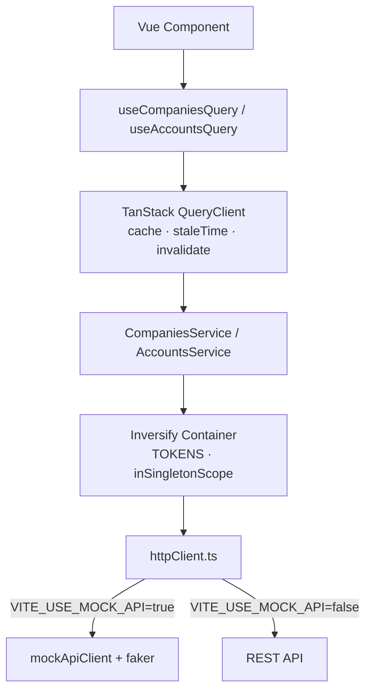

# trade-hub

> Investor platform — Vue 3 SPA с DI-архитектурой (Inversify), server state (TanStack Query) и полным покрытием тестами.

[](https://www.typescriptlang.org/)
[](https://vuejs.org/)
[](https://pinia.vuejs.org/)
[](https://inversify.io/)
[](https://tanstack.com/query)
[](https://vitest.dev/)
[](https://www.cypress.io/)

**[🚀 Live Demo](https://dbvex.github.io/trade-hub/)** · **[Архитектура](#архитектура)** · **[Тесты](#тесты)**

---

## О проекте

Платформа для инвесторов с информацией о компаниях, финансовых инструментах, портфелях и торговых операциях. Проект демонстрирует **enterprise-подход** к архитектуре Vue 3 SPA:

- **Inversify IoC** — все сервисы регистрируются в контейнере, composables получают зависимости через `container.get(TOKEN)`
- **TanStack Query** — server state с кэшированием, `staleTime` и инвалидацией вместо ручного `ref<loading>`
- **TypeScript strict** — `experimentalDecorators`, `emitDecoratorMetadata`, без `any`
- **Mock API** — реалистичные данные через `@faker-js/faker`, переключаемый через env

---

## Архитектура

```
┌─────────────────────────────────────────────────────────────┐
│                     Presentation Layer                       │
│  Vue Components (CompanyPage.vue, AccountsPage.vue, ...)    │
└────────────────────────┬────────────────────────────────────┘
                         │ вызывает
┌────────────────────────▼────────────────────────────────────┐
│                  Server State Layer                          │
│  TanStack Query composables (useCompaniesQuery, useAccounts │
│  Query) — кэш, staleTime, invalidateQueries                 │
└────────────────────────┬────────────────────────────────────┘
                         │ container.get(TOKEN)
┌────────────────────────▼────────────────────────────────────┐
│              Service Layer  (Inversify IoC)                  │
│  @injectable() CompaniesService  ·  AccountsService         │
│  InstrumentsService  ·  PortfolioService  ·  TradesService  │
└────────────────────────┬────────────────────────────────────┘
                         │ axios
┌────────────────────────▼────────────────────────────────────┐
│                      API Layer                               │
│  httpClient.ts — переключение Mock / Real по VITE_USE_MOCK  │
│  mockApiClient.ts — REST-эмуляция с задержками              │
└─────────────────────────────────────────────────────────────┘
```



### Структура проекта

```
src/
├── app/
│   ├── index.ts              # VueQueryPlugin + QueryClient (staleTime 5min)
│   └── providers/router/     # Vue Router
├── domains/                  # Доменный слой
│   ├── companies/
│   │   ├── CompaniesService.ts       # @injectable()
│   │   ├── composables/
│   │   │   ├── useCompaniesQuery.ts  # TanStack Query (computed queryKey + search)
│   │   │   └── useCompanies.ts       # legacy imperative composable
│   │   └── __tests__/
│   ├── accounts/  instruments/  portfolio/  trades/   # аналогично
├── shared/
│   ├── config/container.ts   # Inversify IoC Container + TOKENS
│   └── api/httpClient.ts     # Mock / Real API switcher
└── mocks/                    # Faker-based mock data + storage
```

---

## Почему Inversify

На проекте **МС ДИАС** (РОСБАНК) мы управляли десятками сервисов через DI-контейнер — это исключало скрытые зависимости между модулями и делало рефакторинг предсказуемым. В `trade-hub` я воспроизвёл тот же подход: все сервисы зарегистрированы как синглтоны через `container.bind().inSingletonScope()`, а composables получают их через `container.get(TOKENS.*)` — без прямых импортов между слоями. Главный бонус в тестах: не нужно городить глобальные стабы, достаточно `vi.mock('@/shared/config/container', ...)` и `container.get` возвращает нужный мок. Это позволило написать изолированные unit-тесты для каждого сервиса без поднятия всего DI-дерева.

```typescript
// container.ts — единственное место где сервисы связываются
container.bind<CompaniesService>(TOKENS.CompaniesService)
  .to(CompaniesService)
  .inSingletonScope()

// composable — получает сервис через токен, не знает о реализации
const companiesService = container.get<CompaniesService>(TOKENS.CompaniesService)

// unit test — подменяем только контейнер, сервис не импортируется напрямую
vi.mock('@/shared/config/container', () => ({
  container: { get: () => mockCompaniesService },
  TOKENS: { CompaniesService: Symbol.for('CompaniesService') }
}))
```

---

## Почему TanStack Query

До рефакторинга каждый composable имел один и тот же boilerplate:

```typescript
// До: ручной server state — в каждом composable
const loading = ref(false)
const error = ref<string | null>(null)
const companies = ref<ICompany[]>([])

async function fetchCompanies() {
  loading.value = true
  error.value = null
  try {
    companies.value = await companiesService.fetchCompanies()
  } catch (err) {
    error.value = err.message
  } finally {
    loading.value = false
  }
}
onMounted(fetchCompanies)
```

После — TanStack Query берёт это на себя:

```typescript
// После: useQuery управляет loading/error/cache автоматически
export function useCompaniesQuery(searchQuery?: Ref<string>) {
  const queryKey = computed(() =>
    searchQuery?.value?.trim()
      ? ['companies', 'search', searchQuery.value]
      : ['companies']
  )

  const { data: companies, isLoading, isError, error } = useQuery({
    queryKey,
    queryFn: () => searchQuery?.value?.trim()
      ? companiesService.searchCompanies(searchQuery.value)
      : companiesService.fetchCompanies(),
    // staleTime наследуется из глобального QueryClient (5 мин)
  })

  return { companies, isLoading, isError, error }
}
```

**Что даёт TanStack Query:**
- `staleTime: 5min` — при переходе назад на страницу данные берутся из кэша мгновенно
- Computed `queryKey` — при изменении `searchQuery` автоматически запускается новый запрос; предыдущий результат остаётся в кэше
- `invalidateQueries({ queryKey: ['accounts'] })` — явная инвалидация после торговых операций
- `enabled: isAuthenticated` — запрос к `/api/user/accounts` не выполняется до авторизации

---

## Быстрый старт

```bash
npm install
npm run dev           # http://localhost:5173 (mock data)
```

```bash
npm run typecheck     # vue-tsc — 0 ошибок
npm run lint          # ESLint — 0 ошибок
npm run test:unit     # Vitest — 44 тестa, coverage 96.5%
npm run test:coverage # Vitest + coverage report
npm run test:e2e      # Cypress (требует npm run preview)
```

---

## Тесты

**44 unit-теста · 7 spec-файлов · coverage 96.5%**

| Файл | Тесты | Что проверяет |
|------|-------|---------------|
| `CompaniesService.spec.ts` | 6 | Все методы API, query params |
| `AccountsService.spec.ts` | 9 | login/logout, localStorage token, isAuthenticated |
| `InstrumentsService.spec.ts` | 10 | fetchStocks/ETFs/Bonds, search с type filter |
| `PortfolioService.spec.ts` | 5 | API + pure методы calculateTotalValue/ProfitLoss |
| `TradesService.spec.ts` | 6 | GET/POST/DELETE, фильтрация по account |
| `useCompaniesQuery.spec.ts` | 4 | TanStack Query с mock container (vi.hoisted) |
| `useAccountsQuery.spec.ts` | 4 | enabled=false когда не авторизован |

**Coverage scope:** только `*Service.ts` + `*Query.ts` (business-logic layer). Vue-компоненты и лэйауты покрываются Cypress E2E.

**Cypress E2E** (`cypress/e2e/companies.cy.ts`):
- redirect `/` → `/companies`
- таблица рендерит строки после загрузки через TanStack Query
- badge с тикером в каждой строке
- поиск запускает новый запрос через reactive queryKey

---

## Стек

| Технология | Версия | Зачем |
|-----------|--------|-------|
| Vue 3 | 3.4 | Composition API, `<script setup>` |
| TypeScript | 5.4 | strict, decorators для Inversify |
| Quasar | 2.16 | UI компоненты (QTable, QInput, QBadge) |
| Inversify | 6.0 | IoC контейнер, `@injectable()`, TOKENS |
| TanStack Vue Query | 5 | Server state, кэш, staleTime, invalidation |
| Pinia | 2.1 | Client state (auth, UI state) |
| Vitest | 1.6 | Unit тесты, coverage v8 |
| Cypress | 13 | E2E тесты |
| @faker-js/faker | 9.3 | Реалистичные mock данные |

---

## Mock данные

- **100 компаний** — реальные тикеры (AAPL, GOOGL, GAZP, SBER и др.)
- **150 инструментов** — 100 акций, 30 ETF, 20 облигаций
- **3 торговых счёта** с балансами
- **50 торговых операций**

Данные генерируются при старте через `@faker-js/faker` и хранятся в `MockStorage`.

---

## Автор

**Dolet Bizhev** — Senior Frontend Developer

[](https://github.com/dbvex)
